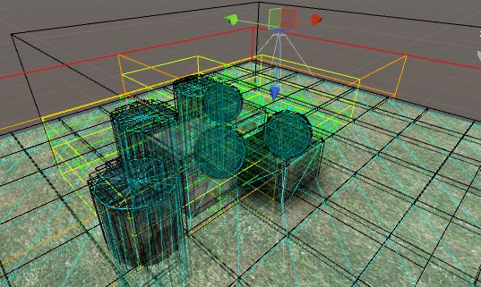
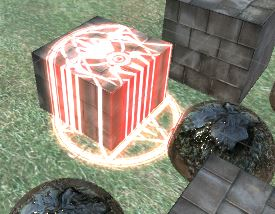
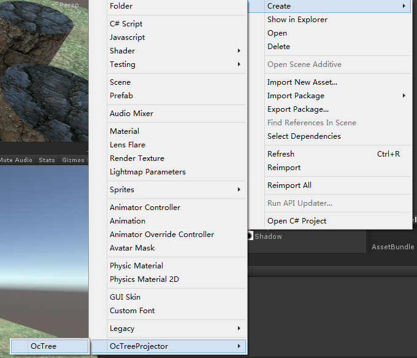
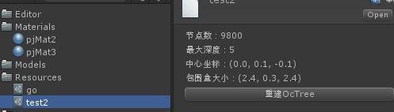
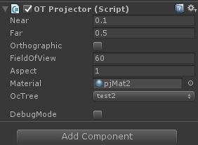

# OcTreeProjector

该插件通过预先将需要应用Projector效果的mesh信息存入八叉树，并在渲染Projector时只渲染投射到的部分的mesh，解决了部分情况下Projector投影的mesh过大导致顶点数浪费的情况。

只渲染投影到的mesh：

使用说明：

一、右键创建OcTree：

二、选择场景中需要应用投影效果的物体，如果其子物体也需要，则勾选包含子物体，点击创建

三、在Resources目录下生成八叉树对象

四、添加OT Projector脚本，设置Projector参数，并在OcTree选项处选择刚刚生成的OcTree对象

